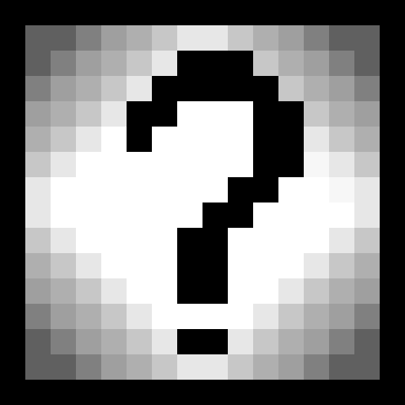

# Untitled Game
<html>
    <!--resize the image-->
    
</html>

    
Table of Contents

    <ol>
        <li><a href="#about">About</a></li>
        <li><a href="#getting-started">Getting Started</a></li>
        <li><a href="#contributing">Contributing</a></li>
        <li><a href="#license">License</a></li>
    </ol>

# About
This is a game I am currently making in my freetime, It is a 2D puzzle game with a focus of using "accidental" mechanics to solve puzzles. The game is currently in development and is not fully playable at all.

# Getting Started
To get started with the game, you will need to download the source code and open it in your favourite IDE. The game is made in the LOVE2D engine, so you will need to download that as well.

# Contributing
If you would like to help out with development of this game, make sure you have some experience with the LOVE2D engine and Lua. If you do, feel free to make a pull request and I will review it.

# License
Distributed under the GNU General Public License. See [LICENSE](LICENSE) for more information.
